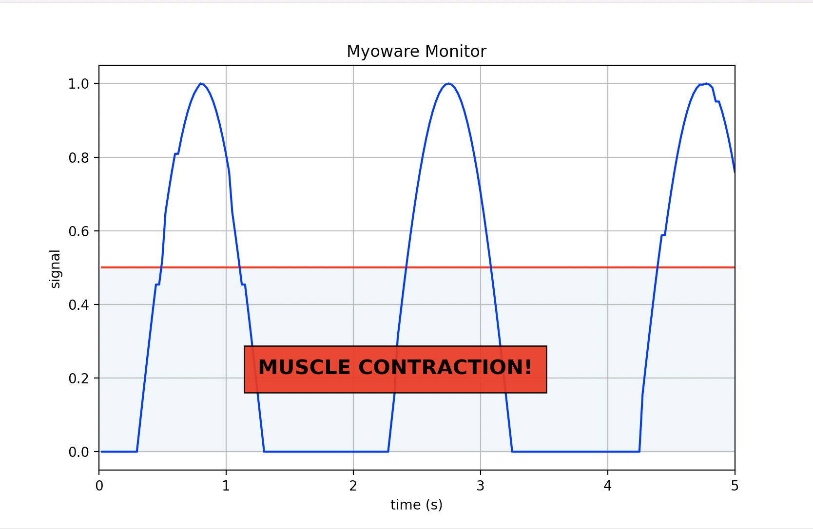

# Myoware Monitor

## Introduction
This python receives incoming serial signal (e.g. from Arduino), processes the data and graphs it using matplotlib.
If no serial connection is detected, a sine wave function is generated where negative values are set to 0 to be able to 
demonstrate the software.

## Data processing
This tutorial processes the incoming data by comparing it to a simple threshold value
and provides feedback to show a muscle contraction is occurring. 
